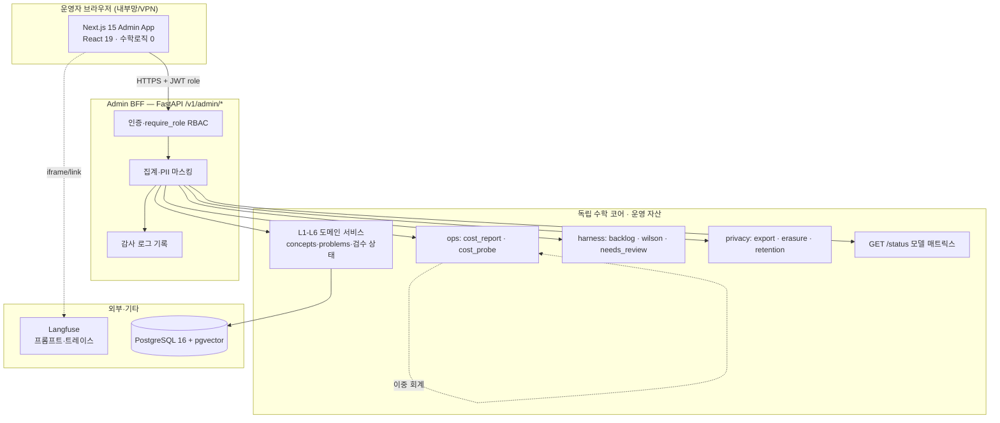

# 04. 관리 UI 아키텍처

> **질문**: 이 관리 UI의 아키텍처는?
>
> **한 줄 답**: **Next.js 15 프런트 + FastAPI `/v1/admin/*` BFF 계층**, 그 앞에 **RBAC(현재 부재·선결)**. 백오피스도 표현≠의미를 지켜 수학 로직을 담지 않고 독립 코어 API만 소비하며, 모든 관리 액션은 불변 감사 로그를 남긴다.

---

## §1. 스택

| 계층 | 기술 | 비고 |
|---|---|---|
| 프런트 | **React 19 + Next.js 15 (App Router)** | 이미 확정된 별도 웹 스택(`CLAUDE.md` 스택 표·교사 대시보드용). 운영 백오피스와 교사 웹이 **스택·컴포넌트 공유**, 배포·인증 도메인만 분리(내부 vs B2B). |
| BFF | FastAPI `/v1/admin/*` 라우터 | 기존 앱(`app.py`)에 신설. 인증·집계·감사 동반. |
| 코어 | 기존 L1-L6 서비스 | 재사용(수학 로직 미이관). |
| 데이터 | PostgreSQL 16 + pgvector | 기존. Neo4j/ClickHouse는 미배선(그래프=PG+`graph.json`). |
| 관측 임베드 | Langfuse | 재구현 없이 링크/임베드. |

---

## §2. 아키텍처 원칙

### 원칙 1 — 표현 ≠ 의미 (백오피스도 예외 없음)
관리 UI도 View Layer. 동치 판정·검산·난이도 추정은 코어(SymPy·L2·L3)가 하고, 콘솔은 *결과를 표시·상태를 전이*만 한다. 수학 로직을 admin 프런트에 넣지 않는다.

### 원칙 2 — Admin BFF 계층
기존 FastAPI에 `/v1/admin/*` 라우터를 신설한다. 목적:
- 운영 엔드포인트(모델 상태·비용 집계·검수 큐·사용자 조회)를 **인증·권한·감사와 함께** 노출.
- **기존 무인증 콘텐츠 CRUD에 RBAC 부착** — `api/concepts.py`·`api/problems.py`의 생성/수정/삭제는 현재 인증 의존성이 없다(실측). BFF가 이들을 `require_role`로 감싸거나, admin 전용 래퍼로 재노출한다.
- 집계·마스킹은 BFF에서 수행(프런트에 원자료 미노출 — 미성년 PII 최소화).

### 원칙 3 — RBAC 신설 (선결·현재 🔴)
**현재 상태(실측)**: `db/models/user.py`의 `UserProfile`에 **role 필드가 없다**. `Role` enum·`require_role`은 `.claude/agents/backend-engineer.md:249-262`에 **설계만** 존재. 콘텐츠 CRUD는 무인증.

**선결 구현**:
1. `Role` enum — 기존 골격 5종(`STUDENT`·`PARENT`·`TEACHER`·`SCHOOL_ADMIN`·`SYSTEM_ADMIN`) + 운영 백오피스용 **`CONTENT_ADMIN`**(콘텐츠 검수자·전권 아님) 추가 제안.
2. `UserProfile.role` 컬럼 신설(Alembic 마이그레이션·기본값 `STUDENT`).
3. `require_role(*roles)` 의존성(`api/_auth.py`의 `get_current_user` 위에 얹음).
4. **2차원 RBAC 매트릭스**(`backend-engineer.md:39` 방향): *역할 × 데이터 항목*. 예 — "교사는 학급 집계는 보되 개별 학생 PII는 못 본다", "부모는 자기 자녀의 *동의된 항목*만". 단순 역할 게이트를 넘어 항목 단위 인가.

### 원칙 4 — 감사 로그(불변)
모든 관리 액션(검수 승인/반려·플래그 변경·삭제·데이터 반출)을 **불변 기록**한다. 기존 자산 재사용: `db/models/audit.py`(삭제 감사)·`backlog/events.ndjson`(하네스 감사). 감사 없는 쓰기 액션 금지.

### 원칙 5 — 외부 도구 임베드 (재구현 금지)
- **Langfuse**(프롬프트 버전·LLM 트레이스): 콘솔은 링크/iframe 임베드. 프롬프트 편집은 Langfuse에서.
- **빌드 하네스**(`backlog.py` 산출·게이트 대장): 콘솔은 결과를 *read*. 상태 변경은 정규 CLI 경로 호출(손편집 금지·[03 §5](03_admin_console_plan.md)).

### 원칙 6 — 측정치 이중 회계
핵심 판정치(로컬 비율·비용·게이트 통과율)는 SaaS(Langfuse)뿐 아니라 **인프로세스**(`ops/cost_probe`)에서도 산출한다. Langfuse가 죽으면 콘솔은 **"측정 실패"를 명시**해야지 "0건 통과"로 위장하면 안 된다(`CLAUDE.md` AI·신뢰 금기).

---

## §3. 컴포넌트·데이터 흐름

- 프런트는 코어를 **직접 호출하지 않는다** — 항상 BFF 경유(인증·마스킹·감사 관문).
- Langfuse만 예외적으로 프런트에서 링크/임베드(관측 SaaS).

---

## §4. 인증·권한 흐름

- **운영자 로그인**: 사내 SSO 또는 별도 관리자 계정. **데모 토큰(`demo_auth`) 절대 금지** — 데모 콜백은 신원 검증 0(prod 금지). 콘솔은 실 신원 필수.
- **권한 판정**: `get_current_user`(Bearer JWT) → `require_role(Role.CONTENT_ADMIN | SYSTEM_ADMIN | ...)` → 2차원 매트릭스로 항목 단위 인가.
- **집행 토큰**: 기존 `security.py`(HS256·sub=user_id·리프레시 `jti` 서버측 취소) 재사용. role은 서버측 조회(토큰에 role을 담더라도 서버가 재확인).

---

## §5. 배포·환경

- **내부망/VPN 한정** — 운영 백오피스는 공개 인터넷에 노출하지 않는다.
- **prod에서 `demo_auth` 비활성**(`WHYMATH_DEMO_AUTH_ENABLED=false`).
- **시크릿 관리**: Langfuse 키·DB URL·JWT 시크릿은 env(`config.py`)·시크릿 매니저. 하드코딩 금지. (자가검증: 등록 직후 길이·자리표시자 검사·값 미출력 — `CLAUDE.md` 시크릿 규칙.)
- **런타임 설정 오버라이드**: `config.py`는 프로세스 env 고정 → 콘솔에서 런타임 변경하려면 **별도 설정 저장/오버라이드 계층**이 필요(별도 태스크). MVP는 **조회만**.

---

## §6. 단계적 구축

| 단계 | 범위 | 선결 |
|---|---|---|
| **Phase A** | read-only 관측: `GET /status`·비용 리포트·게이트·검수 큐 | Admin BFF(read) |
| **Phase B** | 콘텐츠 검수 승인·문항 CRUD (쓰기) | **RBAC** + 감사 로그 |
| **Phase C** | 교사 웹 B2B 합류(L7 Phase3) | 2차원 RBAC 매트릭스 |

---

## §7. 선결·후속 backlog 제안 (등재는 `backlog.py` 경유)

> 아래는 **제안**이다. 실제 태스크 등재는 `python3 scripts/harness/backlog.py`를 통해 하며, `backlog/` 대장을 손편집하지 않는다(`CLAUDE.md` 거부 우회 금지).

- **ADMIN-RBAC** — `Role` enum + `UserProfile.role`(Alembic) + `require_role` + 콘텐츠 CRUD 인가 부착. (선결·최우선)
- **ADMIN-BFF** — `/v1/admin/*` 라우터(모델 상태·비용·검수 큐·사용자 조회)·집계·마스킹·감사.
- **ADMIN-REVIEW-UI** — 검수 큐 UI(`needs_review_worklist` 소비)·DRAFT→PRESCREENED→APPROVED 상태 전이.
- **ADMIN-WEB** — Next.js 15 백오피스 셸(내부망·SSO).

---

**버전**: 1.0 | **작성**: 2026-07-24 | **교차링크**: [00_index](00_index.md) · [03 구성 계획](03_admin_console_plan.md) · `.claude/agents/backend-engineer.md` · `../architecture/07_community.md`
